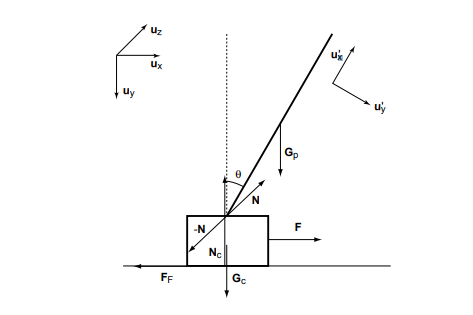
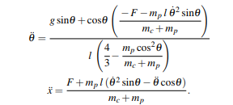

# DD1349-projinda

## Game of cartpol:

You are being welcomed to the game of *cartpol*. Can you beat an neural network in this game? Lets find out!

The rules are simple, navigate the table on the screen using left and right arrow. There is a stick that is attached thorugh a 90 degrees angle with respect to the table. Applying a force on the table (equivalent with moving the table) causes the stick to move. You loose if either of the following occurrences take place:

- **You fail to stay in the path:** The path is marked as an black line, the table isn´t aloud to go outside of it.

- **You fail to balance the stick:** The stick isnt aloud to fall under the tables path.

There is no finishing number of rounds, the game simply resets everytime you fail. Keep on going for as many times as you like!

#### Physics of cartpol:

While it might seem to be an easy set up, an cartpol implementation follows some advance physic implementation. From simple physics, we now that we have to apply a force to move an object. If the ground below this object is frictionless, the velocity will keep constant efter the force has been aplied. This is how the movement is controlled. Everytime you press left or right key, an force of magnitude 100 is applied to the table from the opposite side. The effect that this has on the stick can be described in the following picture:

This is a lot to take in... As an summary of the easiest parts, we have the force working on the object marked with a **F**. **ux, uy,** represents the effect of this force on the stick. **uy** is later combined with the gravitational force **Gp** as the angle theta increases from its initial value zero. The system gives the following formula:

Wich are two second degree differential equations solving the angle theta with respect to the center of the tables **x** coordinate, and the end of the stick. This system can be solved by rewritting it to an ODE-system and then Eulers formula:

# Useful Resources

## Neural Network
[Self-made network for handwritten digits](http://neuralnetworksanddeeplearning.com/chap1.html)

## Q learning
[Simple step-by-step Q algorithm](http://mnemstudio.org/path-finding-q-learning-tutorial.htm)

[Indepth on using networks to estimate Q function](https://rubenfiszel.github.io/posts/rl4j/2016-08-24-Reinforcement-Learning-and-DQN.html)

[Has links to more resources](https://skymind.ai/wiki/deep-reinforcement-learning#define)
