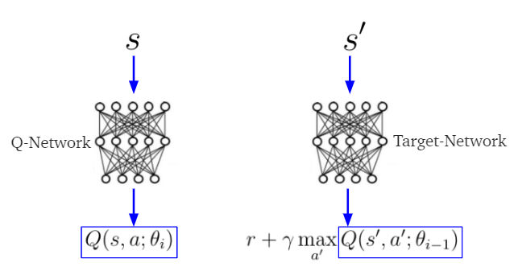
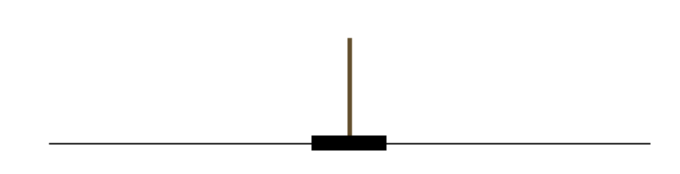
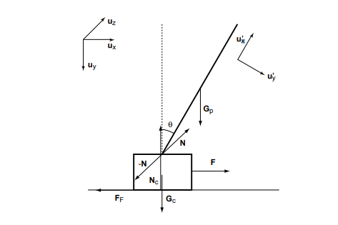
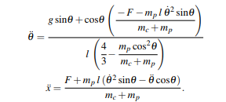
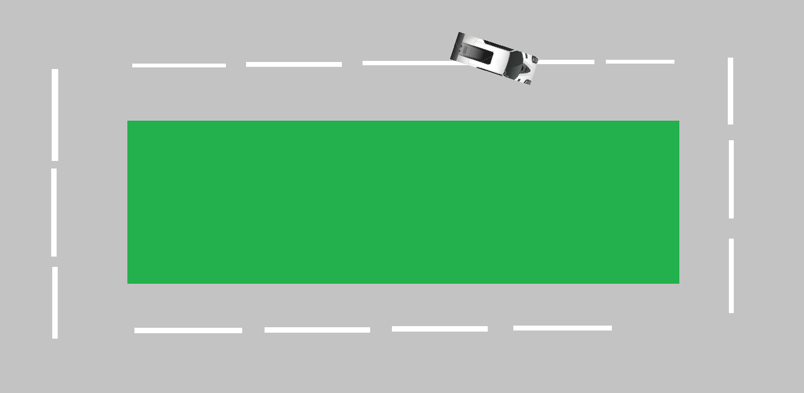
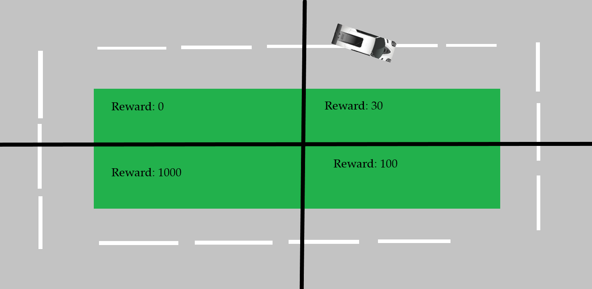
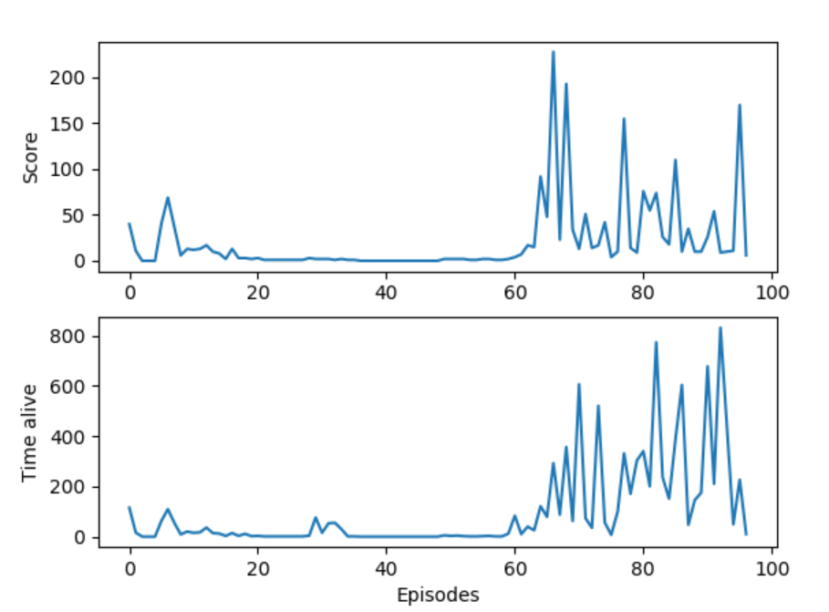
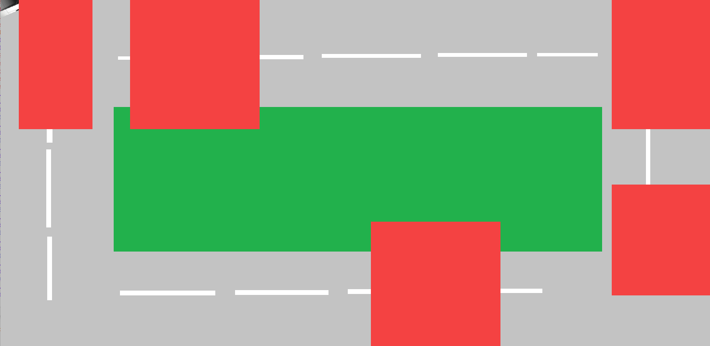

# DD1349-projinda

This project focuses on creating a model free learning algorithm that can play simple video games. The algorithm that learns to play the games is called Deep Q Learning. In this project we demonstrate the algorithm's ability to learn to play three games: Cart pole, Snake, and a Car game.

## Deep Q Learning

Q learning can be used when you have a discretized action and state space. In our scenario an agent is given a game state and it must decide which action to take with the goal of maximizing its reward.

If you imagine a table where each row represents a certain state of a game and each element of that row represents the reward of choosing each action at that state, this is called a Q table. With perfect knowledge of how the game works you could create a perfect Q table and even use a stochastic process to update a Q table, effectively "learning" to play a game. The problem is that even relatively simple games can have very large state spaces and thus very large Q tables. Chess is estimated to have around 10^128 game states, even larger than the estimated number of atoms in the observable universe, 10^80. To solve this deep Q learning replaces a Q table with a neural network that, through playing a game, learn to estimate a perfect Q table.

In out implementation of Q learning we use one network to choose actions and train on the results and another network, called a target network, to predict the potential future rewards of those actions, a process called temporal difference learning. In addition, instead of training the network on what happens in the game chronologically, the agent has a memory of a fixed size and trains on its memories of the games in a random order.

## Game of cartpol

You are being welcomed to the game of *cartpol*. Can you beat a neural network in this game? Lets find out!

The rules are simple, navigate the table on the screen using left and right arrow. There is a stick that is attached thorugh a 90 degrees angle with respect to the table. Applying a force on the table (equivalent with moving the table) causes the stick to move. You loose if either of the following occurrences take place:

- **You fail to stay in the path:** The path is marked as an black line, the table isn´t aloud to go outside of it.

- **You fail to balance the stick:** The stick isnt aloud to fall under the tables path.

There is no finishing number of rounds, the game simply resets everytime you fail. Keep on going for as many times as you like!

#### Physics of cartpol:

While it might seem to be an easy set up, an cartpol implementation follows some advance physic implementation. From simple physics, we now that we have to apply a force to move an object. If the ground below this object is frictionless, the velocity will keep constant efter the force has been aplied. This is how the movement is controlled. Everytime you press left or right key, an force of magnitude 100 is applied to the table from the opposite side. The effect that this has on the stick can be described in the following picture:

This is a lot to take in... As an summary of the easiest parts, we have the force working on the object marked with a **F**. **ux, uy,** represents the effect of this force on the stick. **uy** is later combined with the gravitational force **Gp** as the angle theta increases from its initial value zero. The system gives the following formula:

Wich are two second degree differential equations solving the angle theta with respect to the center of the tables **x** coordinate, and the end of the stick. This system can be solved by rewritting it to an ODE-system and then Eulers formula:

## Car Game
The rules of the car game is easy, a car is being controlled with 4 different action:

- **Accelerate**: Provides a forward force.
- **Right turn**: Turnes the car to the right.
- **Left turn**: Turn car to the left.
- **Brake**: Gives a velocity opposite direction of velocity.

The more in-depth physics has inspiration from [the following implementation](http://rmgi.blog/pygame-2d-car-tutorial.html) and is also explained in-code.

The track of the car has a rectangular shape with a patch of grass in its center. The goal of the car-game is to drive around the course without breaking the canvas or grass limits.

# The reward system:

Three reward systems has been implemented and tested seperatly to find the optimal implementation. They look as follows.

**1. Staying alive:**
Rewarding the system only if it stays alive. This involves a starting reward of turning or moving forward. Breaking gives no reward. Breaking the limits gives a high negative reward.

**2. Progressing on path:**
Rewarding the system if it accesses new parts of the track. This is done by dividing the track into 4 parts. All in wich has different initiall rewards (0,30,100,1000). Breaking the limits again gives a high negative reward and the different rewards is set to 0 if the car breaks.

**The result:**

**3. Reward gates:**
The last reward system constist of high reward spots on the map. They Give high rewards the first time the car is positioned inside its limits. The car, as usual, also gets a small reward for going forward. Also, a high negative reward for breaking boundaries. The red boxes represents *Reward Gates*:

